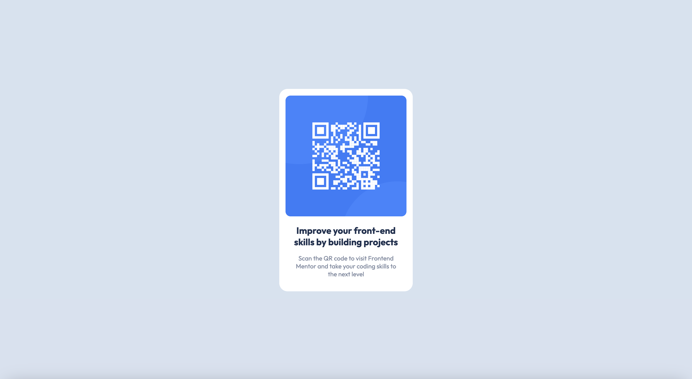

# Frontend Mentor - QR code component solution

This is a solution to the [QR code component challenge on Frontend Mentor](https://www.frontendmentor.io/challenges/qr-code-component-iux_sIO_H). Frontend Mentor challenges help you improve your coding skills by building realistic projects.

## Table of contents

- [Overview](#overview)
  - [Screenshot](#screenshot)
  - [Links](#links)
- [My process](#my-process)
  - [Built with](#built-with)
  - [What I learned](#what-i-learned)
- [Author](#author)

## Overview

### Screenshot

### Links

- Solution URL: [https://github.com/maryam-nasir/fm-qr-code-component](https://github.com/maryam-nasir/fm-qr-code-component)
- Live Site URL: [Add live site URL here](https://your-live-site-url.com)

## My process

### Built with

- Semantic HTML5 markup
- CSS custom properties
- Flexbox

### What I learned

I learned CSS Flexbox and Grid just last week and working on this project and using CSS Flexbox helped reinforce
my learning and improve my skills in CSS.

## Author

- LinkedIn - [Maryam Nasir](https://www.linkedin.com/in/maryam-nasir/)
- Frontend Mentor - [@maryam-nasir](https://www.frontendmentor.io/profile/maryam-nasir)
- Twitter - [@maryamnasir555](https://twitter.com/maryamnasir555)
